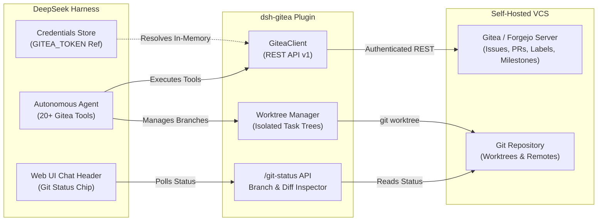

# 📦 @goodandready/dsh-gitea

<div align="center">

<h3>Enterprise Gitea & Forgejo Integration Suite for DeepSeek Harness</h3>

<p align="center">
  <a href="https://www.npmjs.com/package/@goodandready/dsh-gitea"></a>
  <a href="LICENSE"></a>
  <a href="https://github.com/topics/dsh-plugin"></a>
  <a href="https://nodejs.org"></a>
</p>

<p align="center">
  <a href="https://goodandready.app/"></a>
</p>

<p align="center">
  <a href="README.md"><b>🇬🇧 English</b></a> •
  <a href="docs/README.ru.md"><b>🇷🇺 Русский</b></a> •
  <a href="docs/README.zh.md"><b>🇨🇳 中文说明</b></a>
</p>

</div>

---

## ⚡ Overview & Problem Solved

When autonomous AI coding agents perform complex multi-step development in DeepSeek Harness, they require seamless access to issue trackers, pull request review workflows, branch creation, and isolated workspace worktrees without risking repository corruption or leaking credentials into chat logs.

**`@goodandready/dsh-gitea`** bridges DeepSeek Harness to self-hosted **Gitea** and **Forgejo** instances. It equips agents with a complete suite of 20+ structured tools, registers a live **Git Status Chip** directly in the Web UI chat header, and enforces safety rails (`confirm: true` merge guards and dedicated write wrappers).

---

## 🏗️ Architecture



---

## ✨ Full Feature Breakdown

### 1. 20+ Agent Tools Suite

All tools infer `owner` and `repo` automatically from the active workspace's `git remote get-url origin` when omitted by the agent.

| Tool Name | Scope | Description | Safety Requirements |
|:---|:---|:---|:---|
| `gitea_issue_create` | Issues | Creates a new issue with title, body, labels, and assignees | - |
| `gitea_issue_list` | Issues | Lists issues with state (`open`/`closed`), milestone, and label filters | - |
| `gitea_issue_get` | Issues | Fetches detailed issue data by issue index | - |
| `gitea_issue_comment`| Issues | Posts comments, progress updates, and code reviews | - |
| `gitea_issue_update` | Issues | Updates issue title, body, or status | - |
| `gitea_issue_close`  | Issues | Closes an issue | - |
| `gitea_issue_search` | Issues | Full-text issue query across the repository/instance | - |
| `gitea_issue_set_labels` | Labels | Replaces or updates issue labels | - |
| `gitea_issue_set_assignee` | Team | Assigns developers or agents to issues | - |
| `gitea_label_list`   | Labels | Lists all repository labels | - |
| `gitea_label_create` | Labels | Creates custom labels with colors | - |
| `gitea_label_delete` | Labels | Deletes repository labels | - |
| `gitea_milestone_list` | Milestones | Lists repository milestones and progress | - |
| `gitea_milestone_create` | Milestones | Creates roadmap milestones with due dates | - |
| `gitea_pr_create`    | Pull Requests | Opens PR from source branch to base branch | - |
| `gitea_pr_list`      | Pull Requests | Lists open and closed pull requests | - |
| `gitea_pr_get`       | Pull Requests | Fetches PR diff summary, reviews, and status | - |
| `gitea_pr_comment`   | Pull Requests | Adds line comments and general PR feedback | - |
| `gitea_pr_merge`     | Pull Requests | Merges PR via merge/rebase/squash | ⚠️ Requires `confirm: true` |
| `gitea_pr_rebase`    | Pull Requests | Auto-rebase PR branch on fresh main (conflicts reported) | ⚠️ Requires `confirm: true` |
| `gitea_worktree_list`| Worktrees | Lists active git worktrees and branch paths | - |
| `gitea_worktree_add` | Worktrees | Creates an isolated worktree for concurrent tasks | - |
| `gitea_worktree_use` | Worktrees | Switches session context to a worktree directory | - |
| `gitea_worktree_remove` | Worktrees | Prunes and deletes completed worktrees | ⚠️ Requires `confirm: true` |
| `gitea_git_graph`    | Git & Graph | Visual topological commit graph with monospace lanes, branch/tag refs, and CI statuses | - |
| `gitea_code_search` | Discovery | Server-side code search across a repo (Gitea API; prefer local codegraph/fff when cloned) | - |
| `gitea_repo_search`  | Discovery | Searches repositories across the Gitea instance | - |
| `gitea_flavor` | Discovery | Detect gitea/forgejo flavor + feature notes | - |
| `gitea_whoami`       | Auth | Returns authenticated user details and permissions | - |

---

### 2. Per-branch PR templates

When creating a PR via issue-flow without an explicit body, the plugin fills a template by branch type: `feat/`, `fix/`, `docs/`, `chore/`, `refactor/`.

### 3. Live Git Status Chip & Topological Commit Graph

The client component injects a real-time Git Status Chip into the DSH Web UI chat header:
* **Active Repository & Branch**: Displays current branch name (e.g., `feature/issue-42-auth`).
* **Tree Cleanliness**: Color-coded badges indicating clean vs dirty working trees and modified files count.
* **Ahead/Behind Sync Badges**: Real-time sync indicator (`↑ahead`, `↓behind`) relative to upstream or `origin/<branch>`.
* **Topological Commit Graph Modal**: Monospace branch/merge lane visualization (`●`, `◆`, `│`), commit links to Gitea Web UI, branch and tag badges, and live Gitea Actions CI statuses (`CI ✓`, `CI ✗`, `CI ●`).
* **Cross-Tab Synchronization**: Efficient multi-tab coordination using `navigator.locks` leader election and `BroadcastChannel`, eliminating duplicate network polling.
* **Uncommitted Diff Inspector**: 1-click panel showing recent commits and uncommitted diff.

---

### 3. Worktree Isolation & Agent Safety Rails

To allow autonomous agents to work on multiple issues without touching the primary branch:
* **Non-destructive Worktrees**: Creates worktree paths under `.worktrees/issue-<id>/` or custom directories.
* **Confirm Guard Matrix**: Destructive operations like `gitea_pr_merge` and `gitea_worktree_remove` strictly require explicit boolean `confirm: true`. Unconfirmed tool calls are automatically rejected.
* **Git Wrapper Enforcement**: Write operations can be routed through a dedicated wrapper (`gitWrapper`, e.g., `git-deepseek-harness`) to enforce agent author signatures.

---

### 4. Gitea Issue Templates Pack

Includes standardized Gitea YAML issue templates under `.gitea/ISSUE_TEMPLATE/`:

| Template File | Purpose | Recommended Starter Labels |
|:---|:---|:---|
| `bug.yaml` | Bug report | `type/bug`, `status/ready` |
| `feature.yaml` | Feature proposal | `type/feature`, `status/ready` |
| `security.yaml` | Security vulnerability | `type/security`, `priority/high`, `scope/security` |
| `research.yaml` | Architectural research / spike | `type/research`, `status/ready` |
| `tech-debt.yaml` | Technical debt & refactoring | `type/tech-debt`, `status/ready` |
| `incident.yaml` | Production incident report | `type/incident`, `priority/critical` |
| `config-change.yaml` | Infrastructure & config change | `type/refactor`, `scope/settings`, `status/ready` |

---

## 📦 Installation

Install via DeepSeek Harness CLI:

```bash
dsh plugin --profile web add @goodandready/dsh-gitea
```

Restart DSH Web UI and perform a hard-refresh (`Ctrl+F5` or `Cmd+Shift+R`).

---

## ⚙️ Configuration

Navigate to **Settings -> Plugins -> Gitea**:

```yaml
# config.yaml
dsh-gitea:
  baseUrl: "https://gitea.yourcompany.com"
  tokenEnv: "GITEA_TOKEN"
  gitWrapper: ""
  timeoutMs: 15000
```

### Settings Reference Table

| Key | Type | Default | Description |
|:---|:---|:---|:---|
| `baseUrl` | `string` | `""` | Base URL of your Gitea or Forgejo instance (e.g. `https://gitea.example.com`) |
| `tokenEnv` | `string` | `"GITEA_TOKEN"` | Name of the DSH Credential containing the personal access token |
| `gitWrapper` | `string` | `""` | Optional executable wrapper for write operations (e.g., `git-dsh`) |
| `timeoutMs` | `number` | `15000` | HTTP request timeout in milliseconds |

> [!IMPORTANT]
> Never put the raw API token in the `tokenEnv` field. Store the token securely in DSH Credentials and enter only its reference key name.

---

## 🔒 HTTPS and mixed content

When DSH is served over HTTPS, embedded Gitea pages must also be HTTPS or the
browser blocks them (mixed content). Requirements:

- Configure Gitea behind HTTPS (or a reverse proxy) and set **Instance URL** to
  the HTTPS endpoint — then generated links are already HTTPS.
- If Gitea only answers HTTP while DSH is HTTPS, the Settings card shows a
  warning. Optionally enable **`forceHttpsUrls`** to rewrite `http://` links to
  `https://` in tool results when Gitea sits behind an HTTPS reverse proxy that
  accepts both schemes.
- Never disable the browser's mixed-content protections.

---

## 🛠️ Reliability, Webhooks & Multi-Platform Support

Added in `v0.4.3`:
- **Webhook Delivery**: `gitea_digest_delivery` and push notification dispatchers use fully-formed HTTP POST JSON requests with standard headers, ensuring delivery to Slack, Discord, Telegram, or custom webhook endpoints.
- **Cross-Platform Path Resolution**: Seamless operation across both POSIX (Linux/macOS) and Windows file systems, normalizing path separators and handling drive letters transparently.
- **Accurate Merge Analytics**: `gitea_repo_analytics` accurately detects merged pull requests matching Gitea's REST API `merged: true` specifications.
- **Branch & Path Policy Checking**: `gitea_pr_policy` reliably parses `requiredChecks` rules alongside protected branch paths from YAML configuration files.
- **Autonomous Tool Routing**: Non-repository tools (`gitea_repo_create_org`, `gitea_repo_bootstrap`, `gitea_digest_delivery`) execute cleanly without requiring an active local Git repository origin.

---

## 🧪 Testing & Verification

Run the comprehensive unit and integration test suite:

```bash
npm test
```

---

## 📄 License

MIT © [GooDAnDReaDY](https://github.com/GooDAnDReaDY)
