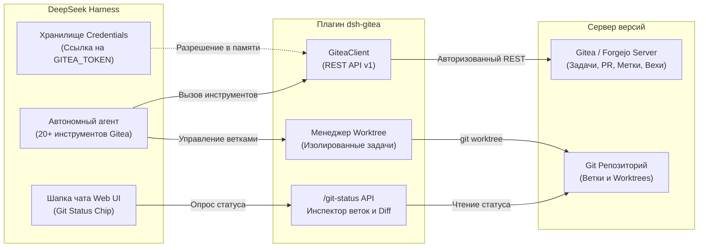

# 📦 @goodandready/dsh-gitea

<div align="center">

<h3>Корпоративная интеграция Gitea и Forgejo для DeepSeek Harness</h3>

<p align="center">
  <a href="https://www.npmjs.com/package/@goodandready/dsh-gitea"></a>
  <a href="LICENSE"></a>
  <a href="https://github.com/topics/dsh-plugin"></a>
  <a href="https://nodejs.org"></a>
</p>

<p align="center">
  <a href="https://goodandready.app/"></a>
</p>

<p align="center">
  <a href="README.md"><b>🇬🇧 English</b></a> •
  <a href="README.ru.md"><b>🇷🇺 Русский</b></a> •
  <a href="README.zh.md"><b>🇨🇳 中文说明</b></a>
</p>

</div>

---

## ⚡ Обзор и решаемая проблема

При выполнении масштабных задач автономной разработки в DeepSeek Harness агентам необходим полноценный доступ к трекеру задач (Issues), созданию и ревью пул-реквестов (PR), управлению ветками и изоляции рабочих сред (Worktrees). Без специализированного плагина агент вынужден выполнять «грязные» правки напрямую в рабочей ветке или обращаться к сторонним CLI без контроля прав доступа.

**`@goodandready/dsh-gitea`** обеспечивает бесшовную интеграцию DeepSeek Harness с серверами **Gitea** и **Forgejo**. Плагин предоставляет агенту 20+ типизированных инструментов, добавляет живой **Git Status Chip** в шапку веб-интерфейса чата и защищает репозиторий барьерами безопасности (требование `confirm: true` для слияния и удаления).

---

## 🏗️ Архитектура



---

## ✨ Исчерпывающий разбор возможностей

### 1. Набор из 20+ инструментов агента

Все инструменты автоматически определяют владельца (`owner`) и имя репозитория (`repo`) из адреса `git remote get-url origin` активной рабочей области, если агент не указал их явно.

| Инструмент | Категория | Назначение | Контроль безопасности |
|:---|:---|:---|:---|
| `gitea_labels` | Метки | Фасад управления метками: `list`, `create`, `delete`, `set` | - |
| `gitea_milestones` | Вехи | Фасад управления вехами: `list`, `create`, `update`, `delete` | ⚠️ Удаление требует `confirm: true` |
| `gitea_releases` | Релизы | Фасад управления релизами: `list`, `create`, `update`, `delete`, `plan`, `notes` | ⚠️ Удаление требует `confirm: true` |
| `gitea_ci` | CI / Actions | Фасад инспекции CI: `status`, `jobs`, `rerun`, `explain` | ⚠️ Перезапуск требует `confirm: true` |
| `gitea_branches` | Ветки | Фасад управления ветками: `list`, `create`, `delete` | ⚠️ Удаление требует `confirm: true` |
| `gitea_tags` | Теги | Фасад управления тегами: `list`, `create`, `delete` | ⚠️ Удаление требует `confirm: true` |
| `gitea_webhooks` | Вебхуки | Фасад управления вебхуками: `list`, `create`, `delete` | ⚠️ Удаление требует `confirm: true` |
| `gitea_org` | Организации | Фасад организаций: `list`, `repos`, `members`, `teams`, `create_repo` | - |
| `gitea_wiki` | Вики | Фасад вики-страниц: `list`, `get` | - |
| `gitea_issue_create` | Задачи | Создание новой задачи с заголовком, описанием, метками и исполнителями | - |
| `gitea_issue_list` | Задачи | Список задач с фильтрацией по статусу (`open`/`closed`), вехам и меткам | - |
| `gitea_issue_get` | Задачи | Получение полной информации о задаче по её номеру | - |
| `gitea_issue_comment`| Задачи | Добавление комментариев, отчётов о прогрессе и ревью | - |
| `gitea_issue_update` | Задачи | Редактирование заголовка, тела или статуса задачи | - |
| `gitea_issue_close`  | Задачи | Закрытие выполненной задачи | - |
| `gitea_issue_search` | Задачи | Полнотекстовый поиск по задачам репозитория/инстанса | - |
| `gitea_issue_set_assignee` | Команда | Назначение ответственных разработчиков или агентов | - |
| `gitea_pr_create`    | Пул-реквесты | Открытие PR из рабочей ветки в целевую | - |
| `gitea_pr_list`      | Пул-реквесты | Список открытых и закрытых PR | - |
| `gitea_pr_get`       | Пул-реквесты | Получение сводки изменений, ревью и статусов проверок | - |
| `gitea_pr_comment`   | Пул-реквесты | Построчные комментарии к коду и обсуждение PR | - |
| `gitea_pr_merge`     | Пул-реквесты | Слияние PR (merge / rebase / squash) | ⚠️ Требуется `confirm: true` |
| `gitea_worktree_list`| Worktree | Список активных изолированных воркдеревьев | - |
| `gitea_worktree_add` | Worktree | Создание изолированного рабочего дерева для отдельной задачи | - |
| `gitea_worktree_use` | Worktree | Переключение контекста сессии в директорию воркдерева | - |
| `gitea_worktree_remove` | Worktree | Удаление и очистка завершённого воркдерева | ⚠️ Требуется `confirm: true` |
| `gitea_issue_templates` | Задачи | Получение и валидация стандартизированных YAML-шаблонов issue из `.gitea/ISSUE_TEMPLATE` | - |
| `gitea_git_graph`    | Git и граф | Визуальный топологический граф коммитов, моноширинные дорожки, ветки/теги и статусы CI | - |
| `gitea_repo_search`  | Поиск | Поиск репозиториев по всему инстансу Gitea | - |
| `gitea_whoami`       | Профиль | Информация об авторизованном пользователе и правах | - |

*(Примечание: Все устаревшие индивидуальные имена инструментов, такие как `gitea_label_list`, `gitea_release_now` и т.д., на 100% поддерживаются через прозрачный маппинг обратной совместимости).*

---

### 2. Git Status Chip и топологический граф коммитов

Клиентский модуль встраивает динамический чип статуса Git прямо в верхнюю панель чата DSH:
* **Активный репозиторий и ветка**: отображает имя текущей ветки (например, `feature/issue-42-auth`).
* **Чистота рабочей копии**: цветной индикатор (чистое дерево vs наличие незакоммиченных правок) и счётчик файлов.
* **Счётчик Ahead/Behind**: живые бейджи расхождения с удалённой веткой (`↑ahead`, `↓behind`).
* **Модальное окно графа коммитов**: моноширинная визуализация дорожек ветвления и слияний (`●`, `◆`, `│`), ссылки на коммиты в Gitea Web UI, бейджи веток/тегов и живые статусы сборок Gitea Actions CI (`CI ✓`, `CI ✗`, `CI ●`).
* **Межвкладочная синхронизация**: выборы лидера через `navigator.locks` и канал `BroadcastChannel`, исключающие дублирующий сетевой поллинг при множестве открытых вкладок.
* **Инспектор несохранённых изменений**: панель в 1 клик с просмотром последних коммитов и диффа незакоммиченных строк.

---

### 3. Изоляция Worktree и безопасность агента

Для безопасного выполнения агентом параллельных задач:
* **Неразрушающие Worktree**: создание рабочих копий по пути `.worktrees/issue-<id>/` без переключения основной ветки.
* **Защита от случайных слияний**: деструктивные операции `gitea_pr_merge` и `gitea_worktree_remove` строго требуют явного параметра `confirm: true`. Неподтверждённые вызовы мгновенно блокируются.
* **Изоляция правки через Git Wrapper**: запись изменений может направляться через специальную обёртку (`gitWrapper`, например `git-deepseek-harness`), сохраняя строгую цифровую подпись агента.

---

### 4. Набор шаблонов задач Gitea Issue Templates

В комплект поставки входит готовый набор шаблонов задач `.gitea/ISSUE_TEMPLATE/`:

| Файл шаблона | Назначение | Рекомендуемые стартовые метки |
|:---|:---|:---|
| `bug.yaml` | Отчёт об ошибке (Bug report) | `type/bug`, `status/ready` |
| `feature.yaml` | Запрос новой функциональности | `type/feature`, `status/ready` |
| `security.yaml` | Отчёт об уязвимости безопасности | `type/security`, `priority/high`, `scope/security` |
| `research.yaml` | Архитектурное исследование / Spike | `type/research`, `status/ready` |
| `tech-debt.yaml` | Технический долг и рефакторинг | `type/tech-debt`, `status/ready` |
| `incident.yaml` | Отчёт об инциденте на проде | `type/incident`, `priority/critical` |
| `config-change.yaml` | Изменение конфигурации и инфраструктуры | `type/refactor`, `scope/settings`, `status/ready` |

---

## 📦 Установка

Установка через консольный клиент DeepSeek Harness:

```bash
dsh plugin --profile web add @goodandready/dsh-gitea
```

Перезапустите Web UI DSH и обновите вкладку в браузере с очисткой кэша (`Ctrl+F5` или `Cmd+Shift+R`).

---

## ⚙️ Конфигурация

Откройте **Настройки -> Плагины -> Gitea**:

```yaml
# config.yaml
dsh-gitea:
  baseUrl: "https://gitea.yourcompany.com"
  tokenEnv: "GITEA_TOKEN"
  gitWrapper: ""
  timeoutMs: 15000
```

### Таблица параметров конфигурации

Карточка плагина в **Настройки -> Плагины -> Gitea** организует все 17 параметров схемы в основные и расширенные секции:

| Параметр | Тип | По умолчанию | Раздел | Описание |
|:---|:---|:---|:---|:---|
| `baseUrl` | `string` | `""` | Основные | Базовый URL вашего инстанса Gitea или Forgejo (например, `https://gitea.example.com`) |
| `tokenEnv` | `string` | `"GITEA_TOKEN"` | Основные | Имя DSH Credential, содержащего персональный токен доступа |
| `defaultOwner` | `string` | `""` | Основные | Организация или пользователь по умолчанию, если не указаны в вызове |
| `defaultRepo` | `string` | `""` | Основные | Репозиторий по умолчанию, если не указан в вызове |
| `gitWrapper` | `string` | `""` | Дополнительные (Git) | Команда-обёртка для операций записи (например, `git-dsh`) |
| `dodReminder` | `boolean` | `false` | Дополнительные (Git) | Напоминание DoD, если инструмент изменил git-файлы без ссылки на задачу/PR |
| `forceHttpsUrls` | `boolean` | `false` | Дополнительные (Git) | Принудительная перезапись ссылок `http://` в `https://` за HTTPS reverse proxy |
| `timeoutMs` | `number` | `30000` | Дополнительные (Git) | Таймаут выполнения HTTP-запросов (в миллисекундах) |
| `webhookSecretEnv` | `string` | `""` | Дополнительные (Вебхуки) | Имя DSH Credential с секретом для проверки подписи `X-Gitea-Signature` |
| `webhookSecret` | `string` | `""` | — | *Устарело*: используйте `webhookSecretEnv`. Оставлено для обратной совместимости |
| `notifyWebhook` | `string` | `""` | Дополнительные (Вебхуки) | Внешний URL вебхука для оповещений о новых PR и упавшем CI |
| `bgSchedulerEnabled` | `boolean` | `false` | Дополнительные (Планировщик) | Включение фонового планировщика проверок здоровья и триажа |
| `bgSchedulerIntervalMin` | `number` | `60` | Дополнительные (Планировщик) | Интервал между фоновыми проверками (в минутах) |
| `bgSchedulerOwner` | `string` | `""` | Дополнительные (Планировщик) | Владелец для фоновых проверок (по умолчанию `defaultOwner`) |
| `bgSchedulerRepo` | `string` | `""` | Дополнительные (Планировщик) | Репозиторий для фоновых проверок (по умолчанию `defaultRepo`) |
| `bgSchedulerWebhook` | `string` | `""` | Дополнительные (Планировщик) | URL вебхука для отправки дайджестов фоновых проверок |
| `instances` | `array` | `[]` | Дополнительные (Инстансы) | Список дополнительных инстансов (`name`, `baseUrl`, `tokenEnv`) |

> [!IMPORTANT]
> Никогда не вставляйте сырой API-токен в поле `tokenEnv`. Токен сохраняется в зашифрованном виде в DSH Credentials, а в настройках указывается только имя ссылки.

---

## 🛠️ Надёжность, вебхуки и кроссплатформенность

Добавлено и улучшено в `v0.4.3`:
- **Доставка вебхуков**: `gitea_digest_delivery` и отправка push-уведомлений формируют полноценные HTTP POST JSON-запросы со стандартными заголовками, гарантируя корректную доставку в Slack, Discord, Telegram или корпоративные вебхуки.
- **Кроссплатформенность путей**: Полная поддержка файловых путей как в Linux/macOS (POSIX), так и в Windows с прозрачной нормализацией разделителей и дисковых букв.
- **Точная аналитика слияний**: Инструмент `gitea_repo_analytics` корректно определяет объединённые PR в соответствии со спецификацией Gitea REST API (`merged: true`).
- **Парсинг политик безопасности**: В `gitea_pr_policy` исправлена обработка списка `requiredChecks` в связке с защищёнными путями репозитория.
- **Автономная маршрутизация инструментов**: Инструменты без привязки к репозиторию (`gitea_repo_create_org`, `gitea_repo_bootstrap`, `gitea_digest_delivery`) работают без наличия локального git origin.

---

## 🧪 Тестирование и верификация

Запуск полного набора юнит- и интеграционных тестов:

```bash
npm test
```

---

## 📄 Лицензия

MIT © [GooDAnDReaDY](https://github.com/GooDAnDReaDY)
