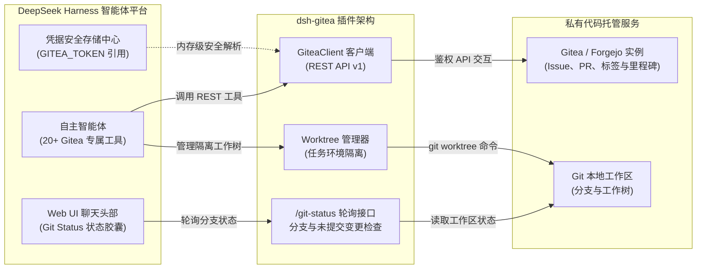

# 📦 @goodandready/dsh-gitea

<div align="center">

<h3>面向 DeepSeek Harness 的企业级 Gitea 与 Forgejo 代码平台深度集成插件</h3>

<p align="center">
  <a href="https://www.npmjs.com/package/@goodandready/dsh-gitea"></a>
  <a href="LICENSE"></a>
  <a href="https://github.com/topics/dsh-plugin"></a>
  <a href="https://nodejs.org"></a>
</p>

<p align="center">
  <a href="https://goodandready.app/"></a>
</p>

<p align="center">
  <a href="README.md"><b>🇬🇧 English</b></a> •
  <a href="README.ru.md"><b>🇷🇺 Русский</b></a> •
  <a href="README.zh.md"><b>🇨🇳 中文说明</b></a>
</p>

</div>

---

## ⚡ 核心定位与解决痛点

在 DeepSeek Harness 中进行多阶段自主编码任务时，智能体需要与私有代码托管平台的 Issue 任务看板、Pull Request 代码审查、多分支开发及独立工作树（Worktree）紧密交互。传统方式下，智能体缺乏统一的权限模型与状态感知，极易产生分支冲突或破坏主干。

**`@goodandready/dsh-gitea`** 实现了 DeepSeek Harness 与私有化部署 **Gitea** 及 **Forgejo** 实例的深度对接。为智能体提供 20+ 个结构化工具，在 Web UI 聊天头部注入实时 **Git Status Chip** 状态胶囊，并设置严格的安全护栏（PR 合并与工作树删除强制要求 `confirm: true`）。

---

## 🏗️ 架构设计



---

## ✨ 核心特性深度解析

### 1. 20+ 智能体结构化工具全家桶

当智能体未显式指定 `owner` 与 `repo` 时，插件自动从当前工作区的 `git remote get-url origin` 智能解析项目信息。

| 工具名称 | 分类 | 功能描述 | 安全校验 |
|:---|:---|:---|:---|
| `gitea_labels` | 标签管理 | 统一标签管理门面：`list`, `create`, `delete`, `set` | - |
| `gitea_milestones` | 里程碑 | 统一里程碑管理门面：`list`, `create`, `update`, `delete` | ⚠️ 删除需 `confirm: true` |
| `gitea_releases` | 发布管理 | 统一发布版本管理门面：`list`, `create`, `update`, `delete`, `plan`, `notes` | ⚠️ 删除需 `confirm: true` |
| `gitea_ci` | CI / Actions | 统一 CI 工作流管理门面：`status`, `jobs`, `rerun`, `explain` | ⚠️ 重新运行需 `confirm: true` |
| `gitea_branches` | 分支管理 | 统一分支管理门面：`list`, `create`, `delete` | ⚠️ 删除需 `confirm: true` |
| `gitea_tags` | 标签管理 | 统一 Git 标签管理门面：`list`, `create`, `delete` | ⚠️ 删除需 `confirm: true` |
| `gitea_webhooks` | Webhook | 统一 Webhook 管理门面：`list`, `create`, `delete` | ⚠️ 删除需 `confirm: true` |
| `gitea_org` | 组织与团队 | 统一组织门面：`list`, `repos`, `members`, `teams`, `create_repo` | - |
| `gitea_wiki` | Wiki 文档 | 统一 Wiki 门面：`list`, `get` | - |
| `gitea_issue_create` | Issue 管理 | 创建新任务 Issue（支持标题、正文、标签与指派人） | - |
| `gitea_issue_list` | Issue 管理 | 获取 Issue 列表（支持状态、里程碑与标签过滤） | - |
| `gitea_issue_get` | Issue 管理 | 根据编号获取 Issue 详细内容与上下文 | - |
| `gitea_issue_comment`| Issue 管理 | 在指定 Issue 下发表评论与进度报告 | - |
| `gitea_issue_update` | Issue 管理 | 修改 Issue 标题、正文描述或状态 | - |
| `gitea_issue_close`  | Issue 管理 | 关闭已完成的 Issue | - |
| `gitea_issue_search` | 搜索检索 | 在整个仓库或实例范围内全文检索 Issue | - |
| `gitea_issue_set_assignee` | 团队协作 | 为 Issue 指派负责人或智能体 | - |
| `gitea_pr_create`    | Pull Request | 从开发分支向基准分支发起 Pull Request | - |
| `gitea_pr_list`      | Pull Request | 查询开放中及已关闭的 PR 列表 | - |
| `gitea_pr_get`       | Pull Request | 获取 PR 的变更代码摘要、审查意见与 CI 状态 | - |
| `gitea_pr_comment`   | Pull Request | 发表 PR 代码行内评审意见或通用反馈 | - |
| `gitea_pr_merge`     | Pull Request | 执行 PR 合并（Merge / Rebase / Squash） | ⚠️ 强制要求 `confirm: true` |
| `gitea_worktree_list`| Worktree | 列出当前活跃的 Git 隔离工作树及路径 | - |
| `gitea_worktree_add` | Worktree | 为独立子任务快速创建隔离的 Git 工作树 | - |
| `gitea_worktree_use` | Worktree | 将当前会话的执行工作目录切换至指定工作树 | - |
| `gitea_worktree_remove` | Worktree | 清理并删除已合并的工作树目录 | ⚠️ 强制要求 `confirm: true` |
| `gitea_issue_templates` | Issue 管理 | 获取并验证 `.gitea/ISSUE_TEMPLATE` 中标准化的 YAML Issue 模版 | - |
| `gitea_git_graph`    | Git 图谱 | 可视化拓扑提交图谱、等宽轨道分支、分支/标签及 CI 状态 | - |
| `gitea_repo_search`  | 发现探索 | 检索 Gitea 实例内的公开与私有代码仓库 | - |
| `gitea_whoami`       | 认证信息 | 返回当前鉴权 Token 对应的用户信息与权限范围 | - |

*(说明：所有历史旧工具名如 `gitea_label_list`、`gitea_release_now`、`gitea_ci_explain` 等均通过无缝兼容映射保持 100% 可用)。*

---

### 2. 聊天头部实时 Git Status 状态胶囊与拓扑提交图谱

客户端组件在 DSH Web UI 顶部导航栏提供直观的 Git 状态胶囊：
* **当前仓库与分支**：实时展示当前所在分支（如 `feature/issue-42-auth`）。
* **工作区干净度指示**：绿色/黄色状态标识当前工作树是否有未暂存的修改及修改文件计数。
* **Ahead/Behind 实时角标**：精准展示与远端分支的超前/落后提交数（`↑ahead` / `↓behind`）。
* **拓扑提交图谱弹窗**：等宽字符分支/合并轨道可视化（`●`, `◆`, `│`）、Gitea Web UI 提交链接、分支与标签角标，以及 Gitea Actions CI 实时状态（`CI ✓`, `CI ✗`, `CI ●`）。
* **跨标签页状态同步**：通过 `navigator.locks` 选举 Leader 与 `BroadcastChannel` 广播，避免多页面重复轮询网络。
* **一键变更抽屉**：点击状态胶囊即可查看最新提交与未暂存 Diff。

---

### 3. Worktree 任务隔离与高危操作防护

* **无损工作树隔离**：在 `.worktrees/issue-<id>/` 目录下为每个 Issue 单独创建工作副本，绝不污染用户的主工作区分支。
* **二次确认熔断机制**：针对 `gitea_pr_merge` 与 `gitea_worktree_remove` 等破坏性操作，必须显式传入布尔值 `confirm: true`，杜绝智能体误操作。
* **Git 专属包装器签名**：写入操作可通过 `gitWrapper`（如 `git-deepseek-harness`）统一调度，保障代码提交签名的可追溯性。

---

### 4. Gitea Issue Templates 任务模板套件

内置位于 `.gitea/ISSUE_TEMPLATE/` 下的标准 YAML 模板：

| 模板文件 | 业务场景 | 建议初始标签 |
|:---|:---|:---|
| `bug.yaml` | 缺陷与 Bug 报告 | `type/bug`, `status/ready` |
| `feature.yaml` | 新功能提案需求 | `type/feature`, `status/ready` |
| `security.yaml` | 安全漏洞与风险排查 | `type/security`, `priority/high`, `scope/security` |
| `research.yaml` | 架构调研与技术探针 | `type/research`, `status/ready` |
| `tech-debt.yaml` | 技术债务与重构任务 | `type/tech-debt`, `status/ready` |
| `incident.yaml` | 生产环境事故报告 | `type/incident`, `priority/critical` |
| `config-change.yaml` | 基础设施与配置变更 | `type/refactor`, `scope/settings`, `status/ready` |

---

## 📦 快速安装

通过 DeepSeek Harness 命令行一键安装：

```bash
dsh plugin --profile web add @goodandready/dsh-gitea
```

重启 DSH Web UI 并强制刷新浏览器页面（`Ctrl+F5` 或 `Cmd+Shift+R`）。

---

## ⚙️ 配置指南

在 Web UI 中打开 **设置 -> 插件 -> Gitea**：

```yaml
# config.yaml
dsh-gitea:
  baseUrl: "https://gitea.yourcompany.com"
  tokenEnv: "GITEA_TOKEN"
  gitWrapper: ""
  timeoutMs: 15000
```

### 配置参数速查表

设置中心 **Settings -> Plugins -> Gitea** 中的卡片将全部 17 个配置项组织为基础与高级设置区域：

| 配置项 | 数据类型 | 默认值 | 区域 | 功能说明 |
|:---|:---|:---|:---|:---|
| `baseUrl` | `string` | `""` | 基础配置 | Gitea 或 Forgejo 实例基础访问地址（如 `https://gitea.example.com`） |
| `tokenEnv` | `string` | `"GITEA_TOKEN"` | 基础配置 | 存储个人访问 Token 的 DSH 凭据键名称 |
| `defaultOwner` | `string` | `""` | 基础配置 | 工具调用缺省时的默认组织或用户名 |
| `defaultRepo` | `string` | `""` | 基础配置 | 工具调用缺省时的默认仓库名 |
| `gitWrapper` | `string` | `""` | 高级设置 (Git) | 用于写操作的 Git 包装器可执行文件（如 `git-dsh`） |
| `dodReminder` | `boolean` | `false` | 高级设置 (Git) | 当工具变更 git 文件且未引用 issue/PR 时提醒 DoD 完成标准 |
| `forceHttpsUrls` | `boolean` | `false` | 高级设置 (Git) | 在 HTTPS 反向代理后强制将 `http://` 转换为 `https://` |
| `timeoutMs` | `number` | `30000` | 高级设置 (Git) | HTTP 请求超时时间（毫秒，默认 30000） |
| `webhookSecretEnv` | `string` | `""` | 高级设置 (Webhooks) | 用于校验 `X-Gitea-Signature` 签名的 DSH 凭据键名称 |
| `webhookSecret` | `string` | `""` | — | *已弃用*: 请改用 `webhookSecretEnv` 凭据引用。仅保留向后兼容 |
| `notifyWebhook` | `string` | `""` | 高级设置 (Webhooks) | 外部通知 Webhook URL，用于 PR 和 CI 失败推送提醒 |
| `bgSchedulerEnabled` | `boolean` | `false` | 高级设置 (调度器) | 启用后台巡检调度器及事件摘要日志 |
| `bgSchedulerIntervalMin` | `number` | `60` | 高级设置 (调度器) | 后台巡检周期间隔（分钟，默认 60） |
| `bgSchedulerOwner` | `string` | `""` | 高级设置 (调度器) | 后台巡检目标组织/用户（默认同 `defaultOwner`） |
| `bgSchedulerRepo` | `string` | `""` | 高级设置 (调度器) | 后台巡检目标仓库（默认同 `defaultRepo`） |
| `bgSchedulerWebhook` | `string` | `""` | 高级设置 (调度器) | 用于接收后台巡检摘要的外部 Webhook URL |
| `instances` | `array` | `[]` | 高级设置 (实例) | 额外 Gitea 实例列表（`name`, `baseUrl`, `tokenEnv`） |

> [!IMPORTANT]
> 切勿将明文 API Token 直接填入 `tokenEnv`。请将 Token 安全保存在 DSH 凭据中心，此处仅填写对应的引用键名。

---

## 🛠️ 可靠性、Webhook 与跨平台支持

在 `v0.4.3` 中新增与优化：
- **Webhook 推送投递**：`gitea_digest_delivery` 与事件推送处理器采用标准 HTTP POST JSON 封装与请求头，确保可靠投递至 Slack、Discord、Telegram 或自定义 Webhook 接收端。
- **全平台路径兼容**：全面兼容 Linux/macOS (POSIX) 与 Windows 文件路径体系，统一斜杠规范化与盘符解析。
- **精准合并统计**：`gitea_repo_analytics` 遵循 Gitea REST API 规范，精确统计已合并的 PR 指标。
- **分支与路径规则校验**：`gitea_pr_policy` 完整解析 YAML 规则中的 `requiredChecks` 列表与受保护分支路径。
- **独立工具执行路由**：无仓库绑定的工具（如 `gitea_repo_create_org`、`gitea_repo_bootstrap`、`gitea_digest_delivery`）无需依赖本地 Git Remote 即可直接执行。

---

## 🧪 测试与校验

运行完整单元测试与集成测试套件：

```bash
npm test
```

---

## 📄 开源许可证

MIT © [GooDAnDReaDY](https://github.com/GooDAnDReaDY)
